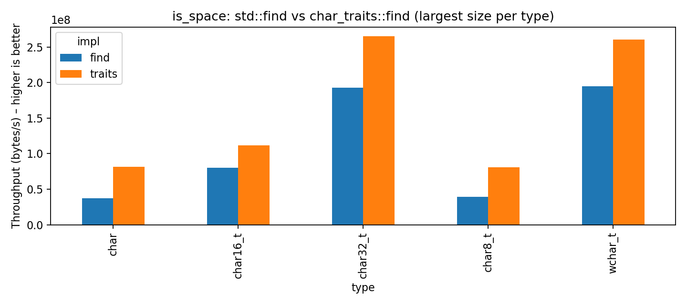

# HorribleChallenges


Horrible C++ Challenges

---


A collection of advanced C++ template/metaprogramming challenges designed to exercise compile-time techniques (C++20). Each challenge lives under `src/` and includes a short spec (`challenge.md`), a minimal test harness and an `include/` folder for your implementation.

## Quick Links


- [CMakeLists.txt](CMakeLists.txt)
- [LICENSE](LICENSE)
- Challenges:
  - [01_type_list](src/01_type_list/challenge.md)
  - [02_expr_eval](src/02_expr_eval/challenge.md)
  - [03_pattern_match](src/03_pattern_match/challenge.md)
  - [04_json_validator](src/04_json_validator/challenge.md)
  - [05_lambda_calc](src/05_lambda_calc/challenge.md)
  - [06_nn_params](src/06_nn_params/challenge.md)
  - [07_type_query](src/07_type_query/challenge.md)
  - [08_type_tree](src/08_type_tree/challenge.md)
  - [09_metafunc_compiler](src/09_metafunc_compiler/challenge.md)
  - [10_reflection_system](src/10_reflection_system/challenge.md)


## Build & Run Tests

```bash
cmake -S . -B build
cmake --build build
ctest --test-dir build
```


## Utility: is_space function

The project includes two implementations of the `is_space` function for checking whitespace characters:

1. `is_space`: Uses `std::find` to search for whitespace characters
2. `is_space_traits`: Uses `std::char_traits::find` for the search operation

### Performance Comparison



The benchmark compares both implementations across different character types (`char`, `char8_t`, `char16_t`, `char32_t`, `wchar_t`). Each implementation is tested with string sizes ranging from 1KB to 1MB. 

Key findings:
- The traits-based implementation generally shows better performance
- Performance characteristics vary across different character types
- Both implementations maintain consistent behavior across all tested character sizes

<details>
<summary>View Implementation Code</summary>

```cpp
template<typename T>
struct is_character_type : public std::false_type { };

template<> struct is_character_type<char>          : public std::true_type { };
template<> struct is_character_type<wchar_t>       : public std::true_type { };
template<> struct is_character_type<char8_t>       : public std::true_type { };
template<> struct is_character_type<char16_t>      : public std::true_type { };
template<> struct is_character_type<char32_t>      : public std::true_type { };
template<> struct is_character_type<unsigned char> : public std::true_type { };
template<> struct is_character_type<signed char>   : public std::true_type { };


template<typename T> 
concept CharacterType = is_character_type<T>::value;


template<CharacterType CharT>
constexpr bool is_space(CharT c) {
  constexpr std::array ws { 
    static_cast<CharT>(U'\x20'),         // SP
    static_cast<CharT>(U'\x09'),         // TAB
    static_cast<CharT>(U'\x0B'),         // VTAB
    static_cast<CharT>(U'\x0C'),         // FF
    static_cast<CharT>(U'\x0D'),         // CR
    static_cast<CharT>(U'\x0A')          // LF
  };

  return std::find(ws.begin(), ws.end(), c) != ws.cend();
}

template<CharacterType CharT, typename Traits = std::char_traits<CharT>>
constexpr bool is_space_traits(CharT c) {
    constexpr std::array<CharT, 6> ws{
        static_cast<CharT>(U'\x20'),
        static_cast<CharT>(U'\x09'),
        static_cast<CharT>(U'\x0B'),
        static_cast<CharT>(U'\x0C'),
        static_cast<CharT>(U'\x0D'),
        static_cast<CharT>(U'\x0A')
    };
    return Traits::find(ws.data(), ws.size(), c) != nullptr;
}
```
</details>

<details>
<summary>View Benchmark Code</summary>

```cpp
template <typename CharT>
static void BM_is_space_find(benchmark::State& st) {
    auto data = make_data<CharT>(static_cast<std::size_t>(st.range(0)));
    for (auto _ : st) {
        std::size_t count = 0;
        for (CharT c : data) {
            benchmark::DoNotOptimize(count += h::is_space(c));
        }
        benchmark::ClobberMemory();
    }
    st.SetBytesProcessed(st.iterations() * st.range(0) * sizeof(CharT));
}

template <typename CharT>
static void BM_is_space_traits(benchmark::State& st) {
    auto data = make_data<CharT>(static_cast<std::size_t>(st.range(0)));
    for (auto _ : st) {
        std::size_t count = 0;
        for (CharT c : data) {
            benchmark::DoNotOptimize(count += h::is_space_traits<CharT>(c));
        }
        benchmark::ClobberMemory();
    }
    st.SetBytesProcessed(st.iterations() * st.range(0) * sizeof(CharT));
}

// Benchmark registration for different character types
BENCHMARK_TEMPLATE(BM_is_space_find, char)->Range(1<<10, 1<<20);
BENCHMARK_TEMPLATE(BM_is_space_traits, char)->Range(1<<10, 1<<20);
```
</details>